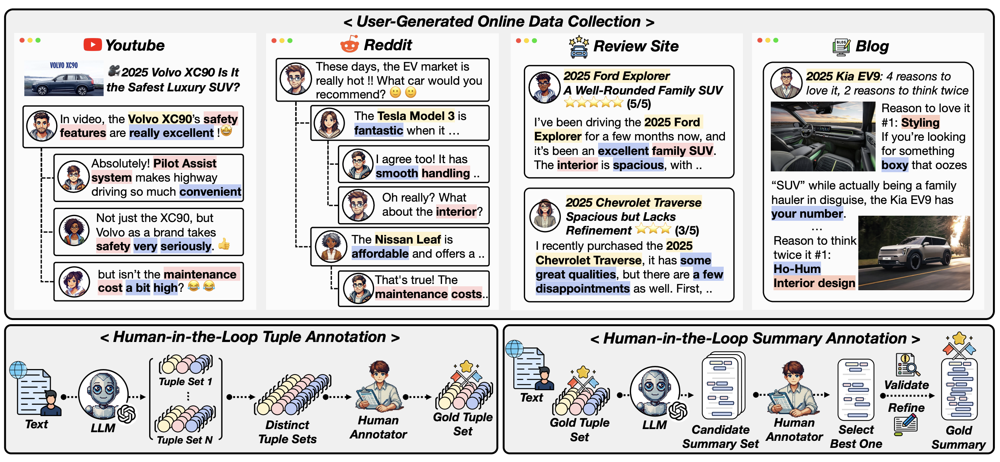

# Online-Opinion-Mining

This repository contains the code and data for the OOMB benchmark introduced in **📄 [Can Large Language Models be Effective Online Opinion Miners?](https://arxiv.org/abs/2505.15695)** 

OOMB is designed to evaluate the capabilities of large language models (LLMs) to perform both extractive and abstractive opinion mining across realistic, multi-source online content.



---

## Dataset Characteristics 

All OOMB data files are located under the `data/oomb_benchmark.pickle/`. The dataset consists of 600 total content instances, broken down by source as follows:

- **Blogs (`content_type = blog`): 115 instances** — Long-form posts describing products or services. 
- **Review Sites (`content_type = review_site`): 106 instances** — Structured product/service reviews with explicit ratings.
- **Reddit (`content_type = reddit`): 177 instances** — Multi-user discussion threads with nested replies.
- **YouTube (`content_type = youtube`): 202 instances** — Single-thread comment chains featuring informal language, emojis, and slang.

Each data instance in OOMB consists of:

- **Entity-feature-opinion tuple:**  
  A list of structured tuples in the form of `(entity, feature, opinion)`, capturing fine-grained user opinions and the exact sentence supporting each opinion.

- **Opinion-Centric Summary:**  
  A concise, 3–5 sentence abstractive summary that groups key opinion topics and overall sentiment about the entity, reflecting major themes and insights found in the input content.

**Example:**

```json
{
  "content_type": "blog",
  "text": "Title: 2021 Honda Ridgeline Review: Why It May Just Be the Perfect Truck for You…",
  "tuple": [
    {
      "entity": "2021 Honda Ridgeline",
      "feature": "capabilities",
      "opinion": "remain the same",
      "evidence_sent": "..."
    },
    {
      "entity": "2021 Honda Ridgeline",
      "feature": "interior",
      "opinion": "reclaims a physical volume knob",
      "evidence_sent": "..."
    }
  "..."
],
  "summary": "The 2021 Honda Ridgeline is ..."
}
```
---

## Evaluation Tasks

Based on this dataset, we design two complementary tasks:

- **Feature-Centric Opinion Extraction (FOE):**  
  Extract structured `(entity, feature, opinion)` tuples from the input content, capturing detailed user opinions grounded in the input content.

- **Opinion-Centric Insight Generation (OIG):**  
  Generate a concise, 3–5 sentence summary that captures overall sentiment trends, recurring themes, and notable strengths or weaknesses about the entity in an abstractive manner.
